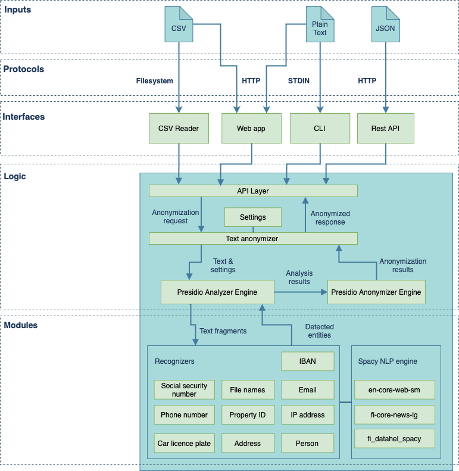

# Text-anonymizer

This is an anonymization tool for Finnish text. The tool enables automatic detection of personal identifiers such as names, phone numbers and social security numbers in Finnish context. Tool masks detected entities with descriptive labels, eg. "050-1231234" will be replaced with \<PUHELIN\>.

This tool can be used via command line interface, rest api and web application. It can handle plain text and csv formats. 

## Getting started

You can use this tool with docker, GitHub Codespaces or you can configure your own python environment. 

### Installation with local python environment

   Requires: Python 3.9, pip   

    # Install project dependencies
    pip install -r requirements.txt
    # Build custom spacy model
    # Link local custon model library to environment libraries so presidio can load it
    train_custom_spacy_model/train_custom_spacy_model.sh
    pip install -e custom_spacy_model

### Installation using docker

Requirements: docker, docker-compose

### Docker: command line tools

If you wish to use command line tools with docker, first build dockerfile (step 1) and then call cli applications with volume mapping (step 2).

1. Build container

       docker build . -t text-anonymizer

2. Run command with volume mapping:
 
       docker run -v <host_source_folder>:<container_work_folder> -it text-anonymizer python anonymize_csv.py <container_work_folder>/<source_file> <container_work_folder>/<target_file>

Example: anonymize text file

       docker run -v /local_data_folder/:/data/files -it text-anonymizer python anonymize_csv.py /data/files/source.csv /data/files/anonymized.csv --column_name=text

### Docker: Anonymizer API

You can run anonymizer rest api with docker-compose. Startup container in API-mode using mode environment variable:

      MODE=api docker-compose up
   
To view api documentation and online-interface: open http://127.0.0.1:8000/docs in browser.

### Docker: Anonymizer Web ui
Startup docker container in flask webapp-mode:

   MODE=web docker-compose up

Open http://127.0.0.1:8000/ in browser.

### Docker: Anonymizer streamlit ui
Startup docker container in streamlit-mode:

   MODE=streamlit docker-compose up

Open http://127.0.0.1:8501/ in browser.

## Anonymizer interfaces

There are different kind of interfaces provided to use text_anonymizer library:

- stdio
- plain text file
- csv file
- JSON/REST api
- Web Application for csv and text input

### Anonymize text through stdio

To anonymize text from standard input, use pipe operator and anonymize.py script.

    cat test.txt | python anonymize.py

### Anonymize tabular data with CSV anonymizer

Script anonymize_csv.py can be used for anonymization of files in csv-format. 
Specify file to read, output file and the column that contains the data to be anonymized.

How to use: 

    usage: anonymize_csv.py [-h] [--column_name COLUMN_NAME] [--column_index COLUMN_INDEX] [--header HEADER] [--delimiter DELIMITER] [--quotechar QUOTECHAR] [--languages LANGUAGES] [--encoding ENCODING] [--debug DEBUG] [--recognizers RECOGNIZERS] source_file target_file

      Anonymize csv file
      
      positional arguments:
        source_file           CSV-file to be anonymized
        target_file           Name or path of (anonymized) destination file.
      
      optional arguments:
        -h, --help            show this help message and exit
        --column_name COLUMN_NAME
                              Name (header) of anonymized column. Default: first column
        --column_index COLUMN_INDEX
                              Index(es) (starting from 0) of anonymized column(s). Default: 0 (first column). Select multiple columns by separating column indexes by comma.
        --header HEADER       CSV file contains header. Default: True
        --delimiter DELIMITER
                              CSV-file delimiter. Default: ;
        --quotechar QUOTECHAR
                              CSV quote character: SINGLE, DOUBLE. Default: none
        --languages LANGUAGES
                              Selected languages (comma separated). Default: fi,en
        --encoding ENCODING   Source encoding. Default: UTF-8
        --debug DEBUG         Toggle debug logging. Default: False
        --recognizers RECOGNIZERS
                              Override active recognizers. Available options: email, phone, ssn, file_name, ip_address, iban, registration_plate, address, blockist, grantlist, property_id, name_fi, name_en, street_address
      
      Example: python anonymize_csv.py file_in.csv file_out.csv --column_name=text

Example:

    python anonymize_csv.py --column_name=text examples/files/sample.csv file_out.csv 

Example 2: Anonymized column is sixth from left, delimiter is comma (,) quote char is single quote ('), file encoding is ISO-8859-1

      python anonymize_csv.py --column_index=5 --delimiter=, --quotechar=SINGLE --encoding=ISO-8859-1 /tmp/file_in.csv /tmp/file_out.csv

Tip: Use debug parameter verbose logging. 

    python anonymize_csv.py --debug=True --column_name=text examples/files/sample.csv /dev/null

### Text anonymizer

Script anonymize_txt.py can be used for anonymization of files in plain text. 
Specify file to read, output file and the column that contains the data to be anonymized.

How to use: 

    usage: anonymize_txt.py [-h] [--column_name COLUMN_NAME] 
                                 [--column_index COLUMN_INDEX]
                                 [--debug DEBUG]
                                 source_file target_file

Example:

    python anonymize_txt.py examples/files/sample.txt file_out.txt 

Tip: Use debug parameter verbose logging. 

    python anonymize_txt.py --debug=True examples/files/sample.txt file_out.txt 

### Rest API

There is a api server script for JSON/REST functionality: api_app.py

Install extra requirements:

    pip install -r requirements-server.txt

Start API server with command: 

    uvicorn anonymizer_api_app.py:anonymizer

Example anonymization request:

    curl -X 'POST' \
      'http://127.0.0.1:8000/anonymize' \
      -H 'accept: application/json' \
      -H 'Content-Type: application/json' \
      -d '{"text": "My Name is Charlie Brown"}'

#### API Documentation (Swagger)

First start api server. Documentation is then available in URL:

    http://127.0.0.1:8000/docs

OpenAPI spec:

    http://127.0.0.1:8000/openapi.json

### Flask web app  anonymizer

This is the production web app for text and csv file anonymization.

Install extra requirements:

    pip install -r requirements-server.txt

Run flask web app:

    flask --app=anonymizer_flask_app:app run

### Streamlit web app anonymizer

There is a sample webapp for csv file anonymization that is built using streamlit. 

First install extra requirements:

      pip install -r requirements-server.txt
      streamlit run anonymizer_web_app.py

Open anonymizer web frontend in browser: http://127.0.0.1:8501

You can test this using file: examples/files/sample.csv

## Accuracy

Note that this tool cannot anonymize 100% of processed text. 

### Names

Using generated names using randomly combined top-1000 finnish first and last names. (See: test/test_main.py)

Iterations: 5000,  error rate: 0.14%, anonymized: 99.44%, partially anonymized: 0.42%

## Model training

Fine tune the base spacy model with custom data.

   cd train_custom_spacy_model
   ./train_custom_spacy_model.sh

This will update custom spacy model in custom_spacy_model folder. You can then run evaluation script to evaluate the model.

## Model evaluation

Run model evaluation script to evaluate custom spacy model. 

   cd custom_spacy_model
   python evaluate_model.py

It will output evaluation results that are included in this README.

### Evaluation results for model

Evaluation dataset consists of 101 sample sentences.

Date: 23.4.2024

Evaluation results: 

| Entity   |   f1-score |   precision |   recall |   samples |
|:---------|-----------:|------------:|---------:|----------:|
| PERSON   |   0.555556 |    0.731707 | 0.631579 |        41 |
| DATE     |   0.295455 |    0.866667 | 0.440678 |        15 |
| LOC      |   0.346154 |    0.580645 | 0.433735 |        31 |
| CARDINAL |   0.125    |    1        | 0.222222 |         4 |
| GPE      |   0.116667 |    1        | 0.208955 |         7 |
| ORDINAL  |   0        |    0        | 0        |           |
| ORG      |   0        |    0        | 0        |           |
| O        |   0        |    0        | 0        |         3 |
| NORP     |   0        |    0        | 0        |           |
| FAC      |   0        |    0        | 0        |           |
| QUANTITY |   0        |    0        | 0        |           |

### Evaluation results from test/evaluation_ensemble.py

Evaluation results

Date: 23.04.2024

| Test    |   Accuracy |   Missed |   Samples |
|:--------|-----------:|---------:|----------:|
| words   |      98.34 |       83 |      5000 |
| names   |      97.54 |        5 |      5000 |
| streets |      96.9  |       31 |      1000 |

## Acknowledgements

This is build on:

Microsoft Presidio Library:

    https://github.com/microsoft/presidio

Spacy Natural Language Processing

    https://spacy.io/

Finnish spacy model:

    https://spacy.io/models/fi

## Data sources: 

Data on municipalities:
https://www.avoindata.fi/data/fi/dataset/kuntaluettelo

Data on postal codes:
https://www.avoindata.fi/data/fi/dataset/suomen-postitoimipaikat

Data on Finnish names:
https://www.avoindata.fi/data/fi/dataset/none

Helsinki areas:
https://www.hel.fi/helsinki/fi/kaupunki-ja-hallinto/hallinto/kaupunginosat/

Helsinki streets:   
http://puhdistussuunnitelmat.fi/helsinki/kadut/

Finnish words list:
https://www.kotus.fi/aineistot/sana-aineistot/nykysuomen_sanalista
